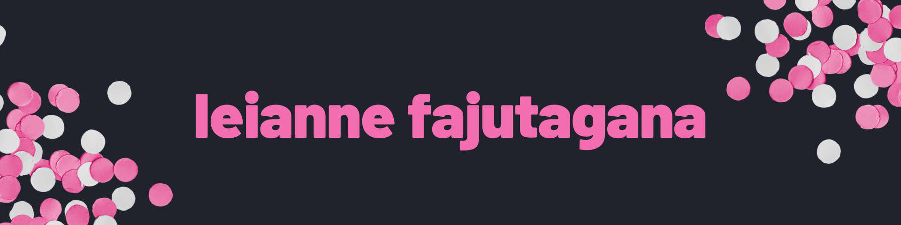

    

  
  
  

## About Me
* 👋 &nbsp;I'm Leianne (she/her)
* 🌉 &nbsp;I'm from the San Francisco Bay Area
* 🧠 &nbsp;I’m currently learning React
* 💖 &nbsp;I love watching anime, stanning BTS, & roller skating 🛼

## Projects
<table>
  <tr>
    <td width="50%">
      <h3 align="center">AI Response Generator</h3>
       
      
       
      
An app that sends text prompts to the OpenAI API and displays the results in a list. The AI model generates a text completion that attemps to match whatever context or pattern you give it!

    </td>
    <td width="50%">
      <h3 align="center">Who's That Pokémon?</h3>
       
      
       
      
A Pokémon guessing game! Try to guess the Pokémon based off of its silhouette.

    </td>
  </tr>
</table>

## Technologies

## My Stats

