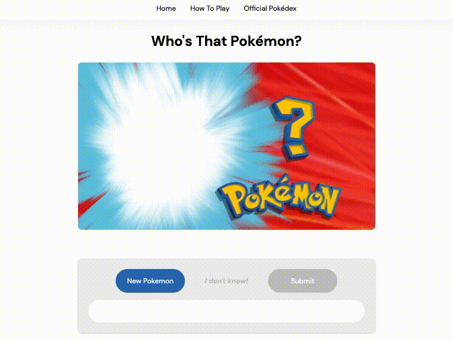

    

  
  
  

## About Me
* 👋 &nbsp;I'm Leianne (she/her)
* 🌉 &nbsp;I'm from the San Francisco Bay Area
* 🧠 &nbsp;I’m currently learning SQL
* 💖 &nbsp;I love watching anime, stanning BTS, & roller skating 🛼

See [my website](https://leianne.netlify.app/) for more information!

## Projects
<table>
  <tr>
    <td width="50%" valign="top">
      <h3 align="center">BTS Memes API</h3>
       
      
       
      

          <a href="https://github.com/leifaj/bts-memes-api">Repo</a>
           | 
          <a href="https://bts-memes-api.herokuapp.com/">Site</a>
      

      
A RESTful API that uses HTTP requests to create, delete, and read bts meme images from a MongoDB database.

    </td>
    <td width="50%" valign="top">
      <h3 align="center">To Do List</h3>
       
      
       
      

          <a href="https://github.com/leifaj/to-do">Repo</a>
           | 
          <a href="https://leifaj.github.io/to-do/">Site</a>
      

      
A simple and intuitive checklist app made with React.

    </td>
  </tr>
  <tr>
  <td width="50%" valign="top">
      <h3 align="center">AI Response Generator</h3>
       
      
       
      

          <a href="https://github.com/leifaj/ai-response-generator">Repo</a>
           | 
          <a href="https://ai-response-generator.herokuapp.com/">Site</a>
      

      
An app that sends text prompts to the OpenAI API and displays the results in a list. The AI model generates a text completion that attemps to match whatever context or pattern you give it!

    </td>
    <td width="50%" valign="top">
      <h3 align="center">Portfolio</h3>
       
      
       
      

          <a href="https://github.com/leifaj/portfolio">Repo</a>
           | 
          <a href="https://leianne.netlify.app/">Site</a>
      

      
My portfolio website. It includes information about me and showcases my skills & projects.

    </td>
  </tr>
  <tr>
    <td width="50%" valign="top">
      <h3 align="center">Who's That Pokémon?</h3>
       
      
       
      

          <a href="https://github.com/leifaj/whos-that-pokemon">Repo</a>
           | 
          <a href="leifaj.github.io/whos-that-pokemon/">Site</a>
      

      
A Pokémon guessing game! Try to guess the Pokémon based off of its silhouette.

    </td>
    <td width="50%" valign="top">
      <h3 align="center">Pixel Art Editor</h3>
       
      
       
      

          <a href="https://github.com/leifaj/pixel-art">Repo</a>
           | 
          <a href="leifaj.github.io/pixel-art/">Site</a>
      

      
A pixel art drawing tool with customizable canvas sizes and color options.

    </td>
  </tr>
</table>

## Technologies

## My Stats

